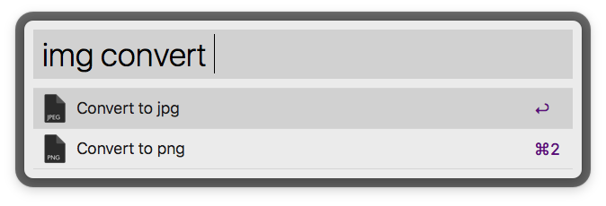
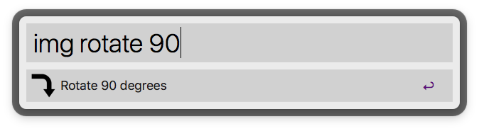

# alfred-image-utilities

A workflow for making quick changes to image files. Alfred-image-utilities grabs any selected images in the frontmost finder window and can apply changes to them. Most of the time a copy of the image is made and its extension is changed to `<filename>.orig.<ext>`. You can replace the original file by holding <kbd>command</kbd> when executing most commands.

# [Download](https://github.com/danielecook/alfred-image-utilities/releases/latest)

__Main Menu__

__Convert to png or jpg__

You can convert from a large number of formats to these jpg or png. The original file is retained unless you hold <kbd>command</kbd>.

__Scale images by a maximum width/height, by percent, or generate thumbnails.__

Hold <kbd>command</kbd> to replace original. This option is not available when generating thumbnails. Generating thumbnails will add a `.thumb` to the filename (`<filename>.thumb.<ext>`)

__Rotate images (clockwise)__

Hold <kbd>command</kbd> to replace original.

__Convert images to black and white.__

Hold <kbd>command</kbd> to replace original.

